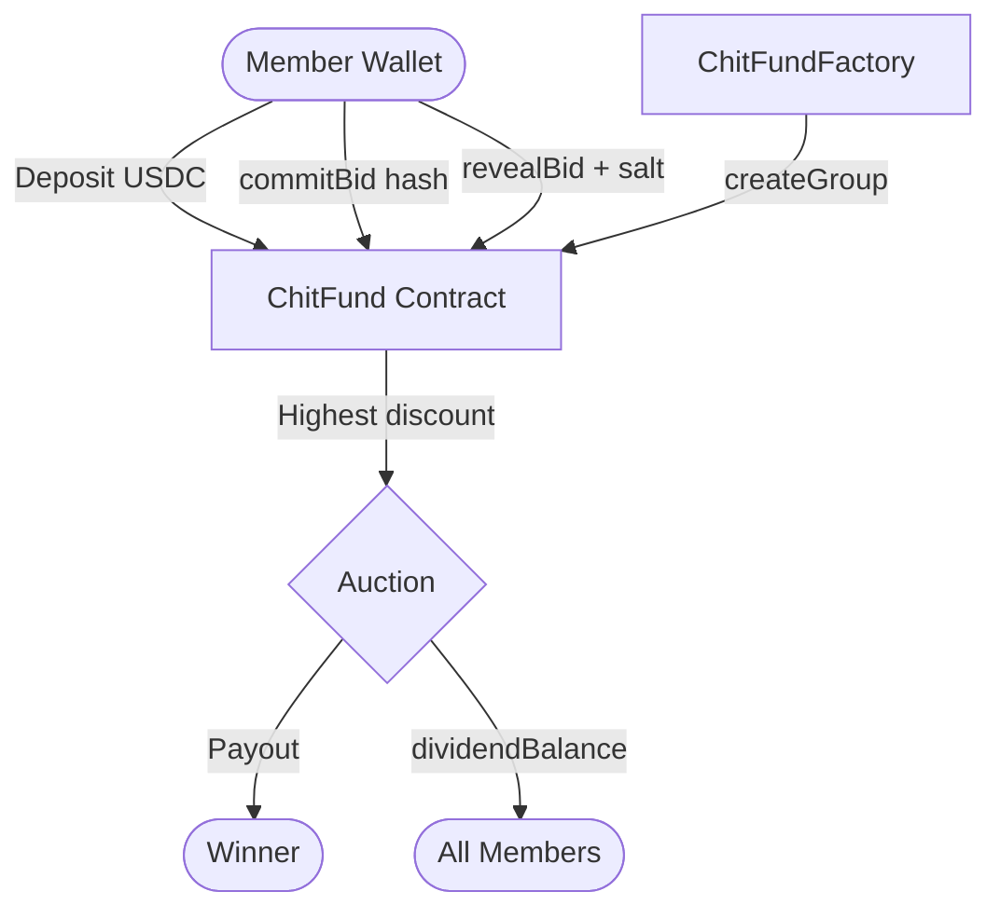

# ChitChain

**On-chain chit fund protocol on Polygon — trustless rotating savings with sealed-bid auctions.**

Built for **ETHGlobal New Delhi 2026**

[](./contracts)
[](./contracts)
[](./frontend)
[](https://amoy.polygonscan.com)

---

## What it is

**ChitChain** is a Web3 protocol that digitizes the chit fund — a ₹50,000+ crore community savings model in India. Members pool USDC each round; one member wins the pot via **commit–reveal auction**; the winner's discount is split as **dividends** to the group.

No foreman. No opaque cash handling. Rules enforced by smart contract.

## Problem → Solution

| Traditional chit fund | ChitChain |
|----------------------|-----------|
| Foreman holds cash | Smart contract holds USDC |
| Rigged / secret auctions | **Commit–reveal** bids on-chain |
| Trust-based dividends | **Automatic** dividend math |
| Local, cash-only | **Wallet + stablecoin**, global access |

## How a round works

```
CONTRIBUTION → COMMIT → REVEAL → DISTRIBUTION
```

1. **Contribute** — members deposit USDC for the round  
2. **Commit** — sealed bid hash (discount % hidden)  
3. **Reveal** — bids opened; **highest discount wins** the pot  
4. **Distribute** — winner paid; discount split as dividends  

**Example:** 5 members × $100 = $500 pot. Winner bids 20% discount → $100 shared → **$20 dividend each**.

## Architecture



## Tech stack

| Layer | Stack |
|-------|--------|
| **Contracts** | Solidity 0.8.24, Foundry, OpenZeppelin |
| **Frontend** | Next.js 16, Tailwind, Wagmi v2, RainbowKit |
| **Network** | Polygon Amoy (80002) · local Anvil for dev |
| **Token** | MockUSDC (6 decimals, public faucet) |

## Quick start

### Tests

```bash
cd contracts && forge test -vvv
```

### Local demo (no testnet tokens)

```bash
./scripts/deploy-local.sh   # starts Anvil, deploys, writes frontend/.env.local
cd frontend && npm install && npm run dev
```

Import Anvil accounts into MetaMask (chain ID **31337**). See **[DEPLOY.md](./DEPLOY.md)** for full E2E testing.

### Amoy testnet

```bash
./scripts/deploy-amoy.sh
```

## Project structure

```
ChitChain/
├── contracts/          # Solidity (ChitFund, Factory, MockUSDC)
├── frontend/           # Next.js dApp
├── scripts/            # deploy-local, deploy-amoy, skip-phase, bid CLI
├── DEPLOY.md           # Deploy & test guide
└── PORTFOLIO.md        # Case study copy for your website
```

## Test coverage

- **41 Foundry tests** including fuzz + full multi-round E2E  
- ~81% line coverage (`ChitFund.sol`, `ChitFundFactory.sol`)

## Portfolio / demo

- **Case study copy:** [PORTFOLIO.md](./PORTFOLIO.md)  
- **Record a 2–3 min demo:** create group → join → commit → reveal → claim  
- **Deploy frontend:** Vercel + Amoy env vars for a live “Try it” link  

## Roadmap

- [ ] Gnosis Safe multisig governance  
- [ ] ENS member identities  
- [ ] Polygon mainnet + real USDC  
- [ ] Verified contracts on Polygonscan  

## License

MIT
